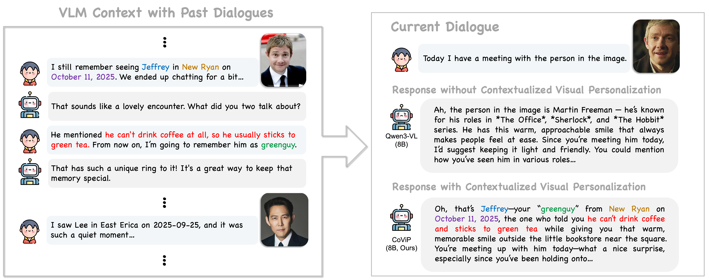

# CoViP: Contextualized Visual Personalization in Vision-Language Models
## ICML 2026

**Authors**: Yeongtak Oh\*, Sangwon Yu\*, Junsung Park, Han Cheol Moon, Jisoo Mok, Sungroh Yoon
(\*: Equal contribution)

<p align="center">
  <a href="https://oyt9306.github.io/covip.github.io" target="_blank">
    
  </a>
</p>

[](https://arxiv.org/abs/2602.03454)
[](https://huggingface.co/Yeongtak/CoViP-Qwen3-VL-8B-GSPO)
[](https://huggingface.co/datasets/Yeongtak/benchmark_CoViP_captioning)
[](https://huggingface.co/datasets/Yeongtak/benchmark_person_pmmlm_v2)
[](https://drive.google.com/file/d/1Ma2g1oSzl8ya0A-wJXMhPHekGLPqlvnW/view?usp=sharing)

<p align="center">
  
</p>

---

## Abstract

Despite recent progress in vision-language models (VLMs), existing approaches often fail to generate personalized responses based on the user's specific experiences, as they lack the ability to associate visual inputs with a user's accumulated visual-textual context. We newly formalize this challenge as **contextualized visual personalization**, which requires visual recognition and textual retrieval of personalized visual experiences by VLMs when interpreting new images.

To address this issue, we propose **CoViP**, a unified framework that treats personalized image captioning as a core task for contextualized visual personalization and improves this capability through reinforcement-learning-based post-training and caption-augmented generation (CAG). We further introduce diagnostic evaluations that explicitly rule out textual shortcut solutions and verify whether VLMs truly leverage visual context. Extensive experiments demonstrate that existing open-source and proprietary VLMs exhibit substantial limitations, while CoViP not only improves personalized image captioning but also yields holistic gains across downstream personalization tasks.

---

## Project Structure

```
CoViP_1/
├── data_construction/          # Scripts to build training data from scratch
│   ├── generate_dialogue.py    # Step 1: Generate personalized dialogues per concept image
│   ├── generate_caption.py     # Step 2: Generate personalized captions using dialogue context
│   └── generate_qa.py          # Step 3: Generate MCQA pairs from dialogues for evaluation
│
├── VLM-R1-Qwen3/               # RL training framework (based on VLM-R1)
│   └── src/open-r1-multimodal/
│       ├── run_scripts/        # Shell scripts to launch training jobs
│       │   ├── run_grpo_pmllm.sh
│       │   ├── run_dr_grpo_pmllm.sh
│       │   ├── run_gspo_pmllm.sh
│       │   └── run_grpo_repic.sh
│       ├── data_config/        # YAML dataset configs
│       │   └── pmllm.yaml
│       └── src/open_r1/
│           ├── grpo_pmllm.py   # GRPO training entry point (CoViP benchmark)
│           ├── dr_grpo_pmllm.py# DR-GRPO training entry point
│           ├── gspo_pmllm.py   # GSPO training entry point
│           ├── grpo_repic.py   # GRPO training entry point (RePIC benchmark)
│           ├── trainer/        # Custom trainer implementations
│           └── vlm_modules/    # VLM-specific modules (Qwen3-VL, InternVL, etc.)
│
├── downstream/                 # Downstream task evaluation scripts
│   ├── w_CAG/                  # With Caption-Augmented Generation (two-stage)
│   │   ├── instruction_triggered_recall.py   # ITR task
│   │   ├── last_action_recall.py             # LAR task
│   │   └── last_seen_detection.py            # LSD task
│   └── wo_CAG/                 # Without CAG (direct inference)
│       ├── instruction_triggered_recall.py
│       ├── last_action_recall.py
│       └── last_seen_detection.py
│
├── evaluation/                 # Caption evaluation pipeline
│   ├── CapEval_QAs_save.py     # LLM-as-a-Judge MCQA evaluation
│   ├── QAS_GT_test.json        # Ground-truth QA pairs for evaluation
│   └── vllm_porting.sh         # Launches local vLLM server for evaluation
│
├── human-evaluation-code/      # Flask app for human evaluation interface
│   └── app.py
│
├── generate_caption_qwen.ipynb # Notebook: generate captions on test benchmark
├── figure1_example.ipynb       # Notebook: reproduce Figure 1 from the paper
├── downstream/lar_eval.ipynb   # Notebook: LAR evaluation analysis
└── imgs/
    └── figure1.png
```

---

## Installation

Our codebase has been tested with **CUDA 12.8** and **Python >= 3.10**.

**Core dependencies:**
```
torch
transformers
trl
vllm
qwen_vl_utils >= 0.0.14
faker
peft
deepspeed
openai
datasets
huggingface_hub
```

For detailed VLM environment setup, follow the [Qwen3-VL repository](https://github.com/QwenLM/Qwen3-VL).

**HuggingFace authentication:**
Set the `HF_TOKEN` environment variable instead of hardcoding tokens:
```bash
export HF_TOKEN="your_token_here"
```

---

## Data Construction

To build training data from scratch using your own image dataset:

```bash
# Step 1: Generate personalized dialogues (requires local image benchmark)
python data_construction/generate_dialogue.py \
    --model_id Qwen/Qwen3-VL-30B-A3B-Instruct-FP8 \
    --batch_size 8 \
    --data_path ./Benchmark/two

# Step 2: Generate personalized captions
python data_construction/generate_caption.py \
    --model_id Qwen/Qwen3-VL-30B-A3B-Instruct-FP8 \
    --batch_size 32 \
    --data_path ./Benchmark/two

# Step 3: Generate MCQA pairs for reward computation
python data_construction/generate_qa.py \
    --model_id Qwen/Qwen3-30B-A3B-Instruct-2507-FP8 \
    --batch_size 8 \
    --data_path ./Benchmark/two
```

Pre-built training data is also available on Google Drive:
- **JSON config** [](https://drive.google.com/file/d/1gdH8HnkIra5P_eFoMuBDaqqVu9jM72V4/view?usp=sharing)
- **Training dataset** [](https://drive.google.com/file/d/1Vgl3vSQXHzgB9sTW03H7KQxJk8a8peln/view?usp=sharing)

---

## Training

### Setup

1. Download the training data files and update the dataset paths in:
   ```
   VLM-R1-Qwen3/src/open-r1-multimodal/data_config/pmllm.yaml
   ```

2. Navigate to the run scripts directory:
   ```bash
   cd VLM-R1-Qwen3/src/open-r1-multimodal/run_scripts
   ```

3. Launch training with the desired RL algorithm:

| Algorithm | Script |
|-----------|--------|
| GRPO      | `run_grpo_pmllm.sh` |
| DR-GRPO   | `run_dr_grpo_pmllm.sh` |
| GSPO      | `run_gspo_pmllm.sh` |

> **Note:** For DeepSpeed ZeRO-3, the `monkey_patch_qwen2_5vl_forward()` patch is applied automatically.

---

## Inference & Evaluation

### 1. Generate captions on the test benchmark

Use the notebook:
```
generate_caption_qwen.ipynb
```

### 2. Start local vLLM server for evaluation

```bash
./evaluation/vllm_porting.sh
```

### 3. Evaluate with LLM-as-a-Judge

Update the `caption_load` path in the script, then run:

```bash
python evaluation/CapEval_QAs_save.py
```

This evaluates captions using MCQA-based scoring (positive and negative concept accuracy).

### 4. Qualitative example (Figure 1)

```
figure1_example.ipynb
```

---

## Downstream Task Evaluation

Three downstream tasks assess personalized memory recall. Each task can be run with or without Caption-Augmented Generation (CAG):

| Task | Script (w/ CAG) | Script (wo/ CAG) |
|------|----------------|-----------------|
| Instruction-Triggered Recall (ITR) | `downstream/w_CAG/instruction_triggered_recall.py` | `downstream/wo_CAG/instruction_triggered_recall.py` |
| Last Action Recall (LAR) | `downstream/w_CAG/last_action_recall.py` | `downstream/wo_CAG/last_action_recall.py` |
| Last Seen Detection (LSD) | `downstream/w_CAG/last_seen_detection.py` | `downstream/wo_CAG/last_seen_detection.py` |

Example usage:
```bash
python downstream/w_CAG/last_seen_detection.py \
    --model_id Yeongtak/CoViP-Qwen3-VL-8B-GSPO \
    --batch_size 4 \
    --data_path Yeongtak/lsd
```

Pass `--hf_token` or set the `HF_TOKEN` environment variable for gated model/dataset access.

---

## Datasets

| Dataset | Description | Link |
|---------|-------------|------|
| CoViP Captioning Benchmark | Full train/test split for personalized image captioning | [Yeongtak/benchmark_CoViP_captioning](https://huggingface.co/datasets/Yeongtak/benchmark_CoViP_captioning) |
| Person-only Captioning Benchmark | Human-centric personalization subset | [Yeongtak/benchmark_person_pmllm_v2](https://huggingface.co/datasets/Yeongtak/benchmark_person_pmmlm_v2) |
| Test Dataset | Benchmark images for evaluation | [Google Drive](https://drive.google.com/file/d/1Ma2g1oSzl8ya0A-wJXMhPHekGLPqlvnW/view?usp=sharing) |

Both HuggingFace datasets are intended for research purposes.

---

## Human Evaluation

The human evaluation web interface is provided for research purposes:
```
human-evaluation-code/app.py
```

---

## Do-lists

- [x] Human evaluation code released
- [x] Evaluation codes for personalized image captioning released
- [x] Training codes for CoViP released

---

## Citation

```bibtex
@article{oh2026contextualized,
  title={Contextualized Visual Personalization in Vision-Language Models},
  author={Oh, Yeongtak and Yu, Sangwon and Park, Junsung and Moon, Han Cheol and Mok, Jisoo and Yoon, Sungroh},
  journal={arXiv preprint arXiv:2602.03454},
  year={2026}
}
```

---

## Acknowledgements

- [RePIC](https://github.com/oyt9306/RePIC)
- [Qwen3-VL](https://github.com/QwenLM/Qwen3-VL)
